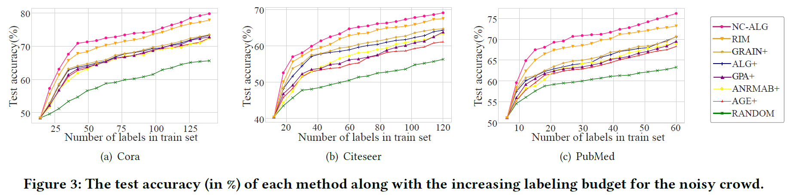
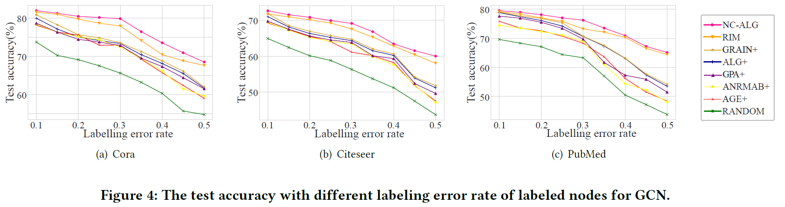
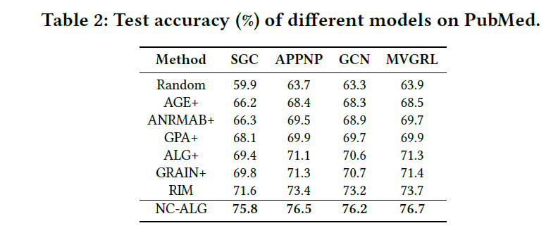
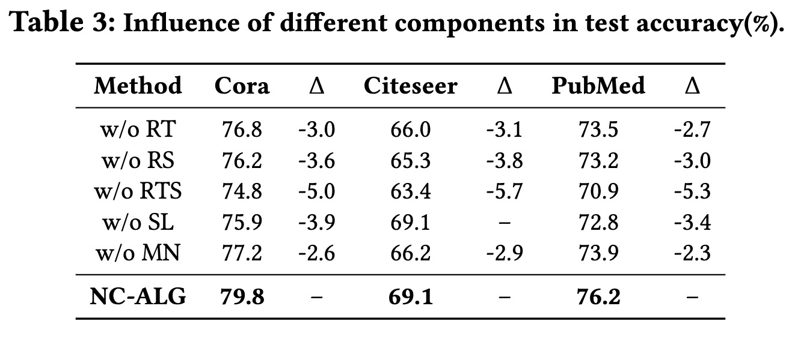

# NC-ALG: Graph-based Active Learning under Noisy Crowd.

This repository is the official implementation of NC-ALG. 

The file "Supplementary-material.pdf" contains:  
* Section 1: Outline
* Section 2: Proof of theorems
* Section 3: Dataset descriptions 
* Section 4: Implementation details

## Requirements

To install requirements:

```setup
pip install -r requirements.txt
```


## Training

To train the model(s) in the paper:


> cd the  “example” data

>run the python file NC-ALG.py 


## Results

1. Accuracy comparison:


2. Accuracy under Different Labeling Budgets:



3. Accuracy under Different Noisy Rates:



4. Generalization Evaluation:



5. Ablation Study:



6. Interpretability:


